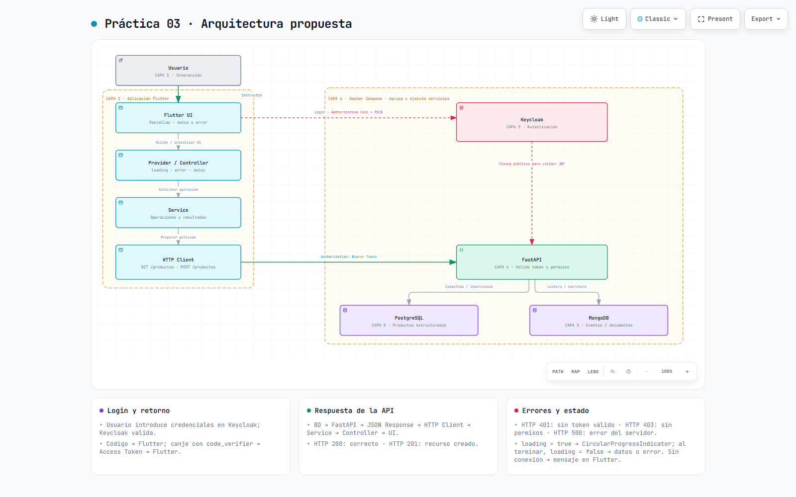
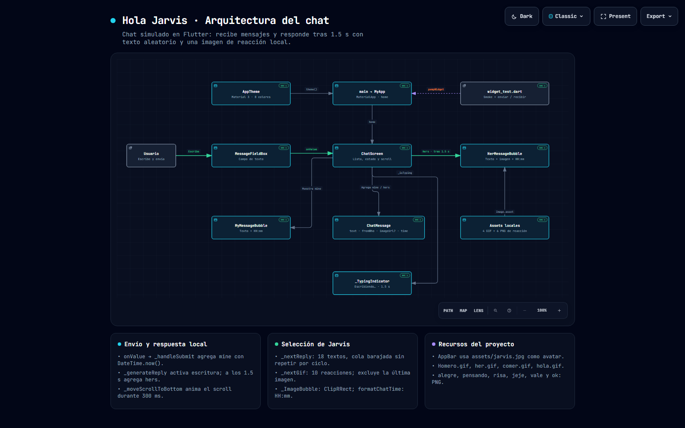

# Práctica 03 · Hola Jarvis — Documentación de los diagramas

Sitio de la **Práctica 03**: los diagramas de arquitectura de la solución
propuesta y del chat que está implementado en Flutter.

Portada: [index.html](index.html) · Diagrama principal:
[arquitectura-practica03.html](arquitectura-practica03.html)

## Índice

1. [Qué documenta este sitio](#qué-documenta-este-sitio)
2. [Arquitectura propuesta por capas](#arquitectura-propuesta-por-capas)
3. [Flujos](#flujos)
4. [Respuestas HTTP](#respuestas-http)
5. [Arquitectura del chat implementado](#arquitectura-del-chat-implementado)
6. [Diagramas disponibles](#diagramas-disponibles)
7. [Regenerar los PNG](#regenerar-los-png)
8. [Publicación con GitHub Pages](#publicación-con-github-pages)

---

## Qué documenta este sitio

El repositorio contiene la aplicación de chat **Hola Jarvis** escrita en Flutter.
La práctica pide, además, una arquitectura por capas con autenticación, backend y
bases de datos, así que el sitio publica dos diagramas distintos:

| Documento | Qué representa | Estado |
| --- | --- | --- |
| `arquitectura-practica03.html` | Arquitectura **propuesta** de la solución: Flutter, Keycloak, FastAPI, PostgreSQL, MongoDB y Docker Compose | Diseño académico, aún no implementado |
| `hola-jarvis.html` | Arquitectura del **chat que sí existe** en `lib/` | Implementado en el repositorio |

> El primer diagrama no afirma que Keycloak, FastAPI, PostgreSQL o MongoDB estén
> programados: describe el diseño que piden los requisitos de la práctica. La
> especificación completa está en
> [`arquitectura-practica03.md`](arquitectura-practica03.md) y el comprobante de
> entrega en
> [`arquitectura-practica03.validacion.md`](arquitectura-practica03.validacion.md).

---

## Arquitectura propuesta por capas



| Capa | Componente | Responsabilidad |
| --- | --- | --- |
| 1 · Usuario | Persona | Escribe mensajes, introduce sus credenciales en el navegador y consulta o crea productos |
| 2 · Aplicación Flutter | `UI` → `Provider / Controller` → `Service` → `HTTP Client` | Estado (`loading`, `error`, datos), preparación de la petición y envío del `Authorization: Bearer TOKEN` |
| 3 · Autenticación | Keycloak | Valida credenciales, devuelve el código de autorización y genera el Access Token; expone claves públicas para validar el JWT |
| 4 · Backend | FastAPI | `GET /productos` y `POST /productos`; valida el Access Token y los permisos antes de operar |
| 5 · Datos | PostgreSQL · MongoDB | Información estructurada de productos y documentos, eventos o registros |
| 6 · Infraestructura | Docker Compose | Agrupa y ejecuta Keycloak, FastAPI, PostgreSQL y MongoDB |

Docker Compose es un contenedor de despliegue: no intermedia las peticiones. La
aplicación Flutter se ejecuta fuera de ese contenedor.

---

## Flujos

1. **Inicio de sesión.** Flutter inicia Authorization Code + PKCE en el navegador
   del sistema. El usuario introduce sus credenciales en Keycloak, que devuelve un
   código a la app. La app canjea el código con el `code_verifier` y recibe el
   Access Token; las credenciales nunca se envían a FastAPI.
2. **Consulta o creación.** Usuario → UI → Controller → Service → HTTP Client →
   FastAPI, con `Authorization: Bearer TOKEN`. FastAPI valida el token y los
   permisos antes de consultar o insertar. No todas las peticiones necesitan las
   dos bases de datos.
3. **Retorno.** PostgreSQL / MongoDB → FastAPI → respuesta JSON y código HTTP →
   HTTP Client → Service → Controller → UI.
4. **Estado.** El Controller establece `loading = true` y la UI muestra
   `CircularProgressIndicator`. Al terminar, incluso si la petición falla,
   establece `loading = false` y actualiza los datos o el mensaje de error.

La validación del JWT usa las claves públicas de Keycloak: FastAPI comprueba
firma, vigencia, emisor y audiencia, y después aplica los permisos. Esa flecha no
supone un inicio de sesión ni una llamada a Keycloak por petición.

---

## Respuestas HTTP

| Situación | Resultado |
| --- | --- |
| Consulta correcta | HTTP 200 + JSON |
| Recurso creado | HTTP 201 + JSON |
| Token ausente, inválido o vencido | HTTP 401 |
| Token válido, permisos insuficientes | HTTP 403 |
| Error del servidor | HTTP 500 |
| Sin conexión | Error local; Flutter muestra un mensaje, sin código HTTP recibido |

---

## Arquitectura del chat implementado



| Nodo | Archivo | Qué hace |
| --- | --- | --- |
| `main` → `MyApp` | `lib/main.dart` | `MaterialApp`, `theme()` y `home` |
| `AppTheme` | `lib/config/theme/app_theme.dart` | Tema Material 3 con ocho colores |
| `ChatScreen` | `lib/Presentencion/chat/chat_screen.dart` | Lista de mensajes, estado y scroll |
| `MessageFieldBox` | `lib/Presentencion/Widgets/shared/message_field_box.dart` | Campo de escritura y envío |
| `MyMessageBubble` | `lib/Presentencion/Widgets/Chat/my_message_bubble.dart` | Burbuja del usuario con su hora |
| `HerMessageBubble` | `lib/Presentencion/Widgets/Chat/her_message_bubble.dart` | Burbuja de Jarvis con texto, imagen y hora |
| `ChatMessage` | `lib/Presentencion/Models/chat_message.dart` | Modelo: `text`, `fromWho`, `imageUrl?` y `time` |
| `_TypingIndicator` | `lib/Presentencion/chat/chat_screen.dart` | Indicador «escribiendo…» durante 1.5 s |
| Assets locales | `assets/` | 4 GIF y 6 PNG de reacción |
| `widget_test.dart` | `test/widget_test.dart` | Smoke test y envío/recepción de un mensaje |

---

## Diagramas disponibles

| Diagrama | Interactivo | Fuente editable | Claro | Oscuro |
| --- | --- | --- | --- | --- |
| Arquitectura propuesta | [arquitectura-practica03.html](arquitectura-practica03.html) | `arquitectura-practica03.json` | [1600×1000](imagenes/diagrama-arquitectura-practica03-1600x1000-light.png) · [1920×1080](imagenes/diagrama-arquitectura-practica03-1920x1080-light.png) | [1600×1000](imagenes/diagrama-arquitectura-practica03-1600x1000-dark.png) · [1920×1080](imagenes/diagrama-arquitectura-practica03-1920x1080-dark.png) |
| Chat implementado | [hola-jarvis.html](hola-jarvis.html) | `hola-jarvis.architecture.json` | [1600×1000](imagenes/diagrama-hola-jarvis-1600x1000-light.png) · [1920×1080](imagenes/diagrama-hola-jarvis-1920x1080-light.png) | [1600×1000](imagenes/diagrama-hola-jarvis-1600x1000-dark.png) · [1920×1080](imagenes/diagrama-hola-jarvis-1920x1080-dark.png) |

Los diagramas son HTML autocontenidos, sin backend, CDN ni dependencias de
red: también funcionan abiertos desde el sistema de archivos. El contenido está
en español; la interfaz fija del visor y su atributo de idioma usan el inglés
predeterminado de Archify.

---

## Regenerar los PNG

Los PNG de `imagenes/` no se editan a mano:

```bash
node tool/diagramas/exportar.mjs
```

Exporta ambos diagramas a 1600×1000 y 1920×1080, en tema claro y oscuro,
reutilizando el navegador headless del skill **Archify**. Si no detecta Chrome,
Chromium ni Edge, define la ruta manualmente:

```bash
# Windows (PowerShell)
$env:ARCHIFY_CHROME = "C:\Program Files (x86)\Microsoft\Edge\Application\msedge.exe"
node tool\diagramas\exportar.mjs

# Linux / macOS
ARCHIFY_CHROME=/usr/bin/chromium node tool/diagramas/exportar.mjs
```

---

## Publicación con GitHub Pages

El sitio se publica desde la rama **`Practica03`**, la que está configurada en
**Settings → Pages** como *Deploy from a branch*. GitHub Pages sirve la raíz del
repositorio, así que cada práctica conserva su documentación dentro de su
proyecto y el `index.html` de la raíz hace de portada común.

| Ruta en el repositorio | URL publicada |
| --- | --- |
| `index.html` | `/MDI-Brian-Jesus-230308/` |
| `Practica03/practica03_brianjesus_230308/docs/` | `/MDI-Brian-Jesus-230308/Practica03/practica03_brianjesus_230308/docs/` |
| `brian_mdi_230308/docs/` | `/MDI-Brian-Jesus-230308/brian_mdi_230308/docs/` |

Para actualizar el sitio basta con subir los cambios a `Practica03`: GitHub
Pages reconstruye el sitio en uno o dos minutos.

El marcador `.nojekyll` de la raíz desactiva el procesamiento de Jekyll, así que
GitHub Pages sirve los archivos estáticos tal cual y el `index.html` de la raíz
tiene prioridad sobre el README. El `docs/.nojekyll` de esta carpeta mantiene el
mismo criterio si algún día se publica esta carpeta por separado.

> **El repositorio debe ser público.** GitHub Pages solo publica repositorios
> privados en planes de pago (Pro, Team o Enterprise). Mientras el repositorio
> sea privado el push se completa pero la URL de Pages devuelve 404.

---

*Documentación de los diagramas de la Práctica 03, 28 de septiembre de 2026.*
