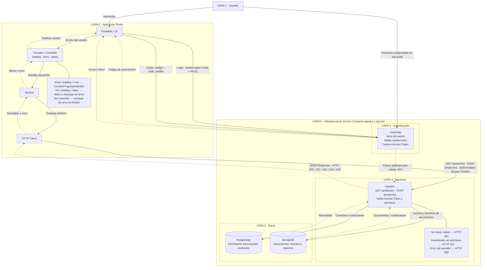

# Práctica 03 — Arquitectura propuesta

Diseño académico basado en los requisitos. El repositorio actual contiene la aplicación de chat Flutter; este documento no afirma que FastAPI, Keycloak o las bases de datos estén implementados.

## Diagrama completo para reproducir en Archify

Las flechas discontinuas distinguen retornos y actualizaciones. Docker Compose es un contenedor visual de infraestructura: no es un intermediario de las peticiones. Flutter se ejecuta fuera de ese contenedor.

## Flujos

1. **Inicio de sesión:** Flutter inicia Authorization Code + PKCE en el navegador del sistema. El usuario introduce sus credenciales en Keycloak. Tras validarlas, Keycloak devuelve un código a Flutter. La app canjea el código con el `code_verifier` y recibe el Access Token. El token queda disponible para el HTTP Client; las credenciales no se envían a FastAPI.
2. **Consulta o creación:** Usuario → UI → Controller → Service → HTTP Client → FastAPI, con `Authorization: Bearer TOKEN`. FastAPI valida el token y los permisos antes de consultar o insertar en PostgreSQL o leer/escribir documentos en MongoDB. No todas las peticiones necesitan ambas bases.
3. **Retorno:** PostgreSQL / MongoDB → FastAPI → respuesta JSON y código HTTP → HTTP Client → Service → Controller → UI.
4. **Estado:** antes de iniciar, Controller establece `loading = true` y notifica a UI para mostrar `CircularProgressIndicator`. Al finalizar, incluso si falla, establece `loading = false`, actualiza datos o error y notifica a UI.

| Situación | Resultado |
|---|---|
| Consulta correcta | HTTP 200 + JSON |
| Recurso creado | HTTP 201 + JSON |
| Token ausente, inválido o vencido | HTTP 401 |
| Token válido, permisos insuficientes | HTTP 403 |
| Error del servidor | HTTP 500 |
| Sin conexión | Error local; Flutter muestra mensaje, sin código HTTP recibido |

La validación JWT se representa mediante claves públicas de Keycloak: FastAPI comprueba firma, vigencia, emisor y audiencia; después aplica los permisos. La flecha de claves no supone un inicio de sesión ni una llamada a Keycloak por cada petición.

## Versión simplificada para copiar a Archify

Crear un diagrama de arquitectura académico, con texto en español, fondo claro, bloques por capas y flechas de solicitud y respuesta. Usar esta distribución:

| Bloque | Posición recomendada | Texto interno |
|---|---|---|
| Usuario | Arriba, sobre Flutter | CAPA 1 · Usuario |
| Aplicación Flutter | Columna izquierda, contenedor | CAPA 2 · Aplicación Flutter |
| UI | Primero dentro de Flutter | Pantallas / UI |
| Controller | Debajo de UI | Provider / Controller · loading, error, datos |
| Service | Debajo de Controller | Service |
| HTTP Client | Debajo de Service | HTTP Client · GET /productos · POST /productos |
| Keycloak | Derecha, parte superior | CAPA 3 · Login, validación de credenciales, PKCE y Access Token |
| FastAPI | Derecha, debajo de Keycloak, frente a HTTP Client | CAPA 4 · Valida Access Token y permisos |
| PostgreSQL | Debajo de FastAPI, izquierda | CAPA 5 · Productos estructurados |
| MongoDB | Debajo de FastAPI, derecha | CAPA 5 · Documentos, eventos o registros |
| Docker Compose | Marco alrededor de Keycloak, FastAPI y ambas bases | CAPA 6 · Agrupa y ejecuta los cuatro servicios |
| Estado Flutter | Nota junto a Controller | loading=true → CircularProgressIndicator; al terminar loading=false → datos/error; sin conexión → mensaje |
| Códigos HTTP | Nota junto a FastAPI | 200 correcto; 201 creado; 401 sin token válido; 403 sin permisos; 500 error del servidor |

Conectar los bloques con estas flechas y etiquetas:

| Origen | Destino | Texto de la flecha |
|---|---|---|
| Usuario | UI | Interactúa |
| UI | Controller | Acción del usuario |
| Controller | Service | Solicitar operación |
| Service | HTTP Client | Preparar petición |
| Flutter UI | Keycloak | Login · Authorization Code + PKCE |
| Usuario | Keycloak | Introduce credenciales |
| Keycloak | Flutter UI | Código de autorización |
| Flutter UI | Keycloak | Canje: código + code_verifier |
| Keycloak | Flutter UI | Access Token |
| HTTP Client | FastAPI | GET /productos · POST /productos · Authorization: Bearer TOKEN |
| Keycloak | FastAPI | Claves públicas para validar JWT |
| FastAPI | PostgreSQL | Consultas e inserciones |
| PostgreSQL | FastAPI | Resultados |
| FastAPI | MongoDB | Lectura y escritura de documentos |
| MongoDB | FastAPI | Documentos / confirmación |
| FastAPI | HTTP Client | JSON Response · HTTP 200 / 201 / 401 / 403 / 500 |
| HTTP Client | Service | Resultado o error |
| Service | Controller | Datos o error |
| Controller | UI | loading = false · Mostrar datos o error |

El HTML ofrece una vista resumida para mantener su legibilidad; las tarjetas explican los retornos, los errores y el estado. Este documento conserva el detalle de todas las flechas para reproducir una versión ampliada. El contenido es español; la interfaz fija del visor y su atributo de idioma usan el inglés predeterminado de Archify.
