# Arbol de directorios completo

```text
brian_mdi_230308/
├── .dart_tool/
│   ├── dartpad/
│   │   └── web_plugin_registrant.dart
│   ├── extension_discovery/
│   │   └── vs_code.json
│   ├── flutter_build/
│   │   └── dart_plugin_registrant.dart
│   ├── hooks_runner/
│   │   ├── objective_c/
│   │   │   └── 196c15e30a/
│   │   │       ├── out/
│   │   │       ├── .lock
│   │   │       ├── dependencies.dependencies_hash_file.json
│   │   │       ├── hook.dependencies_hash_file.json
│   │   │       ├── hook.dill
│   │   │       ├── hook.dill.d
│   │   │       ├── input.json
│   │   │       ├── output.json
│   │   │       ├── stderr.txt
│   │   │       └── stdout.txt
│   │   └── shared/
│   │       └── objective_c/
│   │           ├── build/
│   │           │   └── 196c15e30a/
│   │           └── .lock
│   ├── package_config.json
│   ├── package_graph.json
│   └── version
├── .idea/
│   ├── libraries/
│   │   ├── Dart_SDK.xml
│   │   └── KotlinJavaRuntime.xml
│   ├── runConfigurations/
│   │   └── main_dart.xml
│   ├── modules.xml
│   └── workspace.xml
├── android/
│   ├── app/
│   │   ├── src/
│   │   │   ├── debug/
│   │   │   │   └── AndroidManifest.xml
│   │   │   ├── main/
│   │   │   │   ├── java/
│   │   │   │   │   └── io/
│   │   │   │   │       └── flutter/
│   │   │   │   │           └── plugins/
│   │   │   │   │               └── GeneratedPluginRegistrant.java
│   │   │   │   ├── kotlin/
│   │   │   │   │   └── com/
│   │   │   │   │       └── example/
│   │   │   │   │           └── brian_mdi_230308/
│   │   │   │   │               └── MainActivity.kt
│   │   │   │   ├── res/
│   │   │   │   │   ├── drawable/
│   │   │   │   │   │   └── launch_background.xml
│   │   │   │   │   ├── drawable-v21/
│   │   │   │   │   │   └── launch_background.xml
│   │   │   │   │   ├── mipmap-hdpi/
│   │   │   │   │   │   └── ic_launcher.png
│   │   │   │   │   ├── mipmap-mdpi/
│   │   │   │   │   │   └── ic_launcher.png
│   │   │   │   │   ├── mipmap-xhdpi/
│   │   │   │   │   │   └── ic_launcher.png
│   │   │   │   │   ├── mipmap-xxhdpi/
│   │   │   │   │   │   └── ic_launcher.png
│   │   │   │   │   ├── mipmap-xxxhdpi/
│   │   │   │   │   │   └── ic_launcher.png
│   │   │   │   │   ├── values/
│   │   │   │   │   │   └── styles.xml
│   │   │   │   │   └── values-night/
│   │   │   │   │       └── styles.xml
│   │   │   │   └── AndroidManifest.xml
│   │   │   └── profile/
│   │   │       └── AndroidManifest.xml
│   │   └── build.gradle.kts
│   ├── gradle/
│   │   └── wrapper/
│   │       ├── gradle-wrapper.jar
│   │       └── gradle-wrapper.properties
│   ├── .gitignore
│   ├── brian_mdi_230308_android.iml
│   ├── build.gradle.kts
│   ├── gradle.properties
│   ├── gradlew
│   ├── gradlew.bat
│   ├── local.properties
│   └── settings.gradle.kts
├── build/
│   ├── 46af278325c492e45c0d28a0a656f020/
│   │   ├── _composite.stamp
│   │   ├── gen_dart_plugin_registrant.stamp
│   │   └── gen_localizations.stamp
│   ├── flutter_assets/
│   │   ├── fonts/
│   │   │   └── MaterialIcons-Regular.otf
│   │   ├── packages/
│   │   │   └── cupertino_icons/
│   │   │       └── assets/
│   │   │           └── CupertinoIcons.ttf
│   │   ├── shaders/
│   │   │   ├── ink_sparkle.frag
│   │   │   └── stretch_effect.frag
│   │   ├── AssetManifest.bin
│   │   ├── AssetManifest.bin.json
│   │   ├── FontManifest.json
│   │   └── NOTICES
│   ├── native_assets/
│   │   └── windows/
│   │       └── native_assets.json
│   ├── test_cache/
│   │   └── build/
│   │       └── 4189cf65caed1f673f0abbe75cfabebb.cache.dill.track.dill
│   └── unit_test_assets/
│       ├── fonts/
│       │   └── MaterialIcons-Regular.otf
│       ├── packages/
│       │   └── cupertino_icons/
│       │       └── assets/
│       │           └── CupertinoIcons.ttf
│       ├── shaders/
│       │   ├── ink_sparkle.frag
│       │   └── stretch_effect.frag
│       ├── AssetManifest.bin
│       ├── FontManifest.json
│       ├── NativeAssetsManifest.json
│       └── NOTICES.Z
├── ios/
│   ├── Flutter/
│   │   ├── ephemeral/
│   │   │   ├── Packages/
│   │   │   │   ├── .packages/
│   │   │   │   └── FlutterGeneratedPluginSwiftPackage/
│   │   │   │       ├── Sources/
│   │   │   │       │   └── FlutterGeneratedPluginSwiftPackage/
│   │   │   │       │       └── FlutterGeneratedPluginSwiftPackage.swift
│   │   │   │       └── Package.swift
│   │   │   ├── .swift_pm.lock
│   │   │   ├── flutter_lldb_helper.py
│   │   │   ├── flutter_lldbinit
│   │   │   └── flutter_native_integration.env
│   │   ├── AppFrameworkInfo.plist
│   │   ├── Debug.xcconfig
│   │   ├── flutter_export_environment.sh
│   │   ├── Generated.xcconfig
│   │   └── Release.xcconfig
│   ├── Runner/
│   │   ├── Assets.xcassets/
│   │   │   ├── AppIcon.appiconset/
│   │   │   │   ├── Contents.json
│   │   │   │   ├── Icon-App-1024x1024@1x.png
│   │   │   │   ├── Icon-App-20x20@1x.png
│   │   │   │   ├── Icon-App-20x20@2x.png
│   │   │   │   ├── Icon-App-20x20@3x.png
│   │   │   │   ├── Icon-App-29x29@1x.png
│   │   │   │   ├── Icon-App-29x29@2x.png
│   │   │   │   ├── Icon-App-29x29@3x.png
│   │   │   │   ├── Icon-App-40x40@1x.png
│   │   │   │   ├── Icon-App-40x40@2x.png
│   │   │   │   ├── Icon-App-40x40@3x.png
│   │   │   │   ├── Icon-App-60x60@2x.png
│   │   │   │   ├── Icon-App-60x60@3x.png
│   │   │   │   ├── Icon-App-76x76@1x.png
│   │   │   │   ├── Icon-App-76x76@2x.png
│   │   │   │   └── Icon-App-83.5x83.5@2x.png
│   │   │   └── LaunchImage.imageset/
│   │   │       ├── Contents.json
│   │   │       ├── LaunchImage.png
│   │   │       ├── LaunchImage@2x.png
│   │   │       ├── LaunchImage@3x.png
│   │   │       └── README.md
│   │   ├── Base.lproj/
│   │   │   ├── LaunchScreen.storyboard
│   │   │   └── Main.storyboard
│   │   ├── AppDelegate.swift
│   │   ├── GeneratedPluginRegistrant.h
│   │   ├── GeneratedPluginRegistrant.m
│   │   ├── Info.plist
│   │   ├── Runner-Bridging-Header.h
│   │   └── SceneDelegate.swift
│   ├── Runner.xcodeproj/
│   │   ├── project.xcworkspace/
│   │   │   ├── xcshareddata/
│   │   │   │   ├── IDEWorkspaceChecks.plist
│   │   │   │   └── WorkspaceSettings.xcsettings
│   │   │   └── contents.xcworkspacedata
│   │   ├── xcshareddata/
│   │   │   └── xcschemes/
│   │   │       └── Runner.xcscheme
│   │   └── project.pbxproj
│   ├── Runner.xcworkspace/
│   │   ├── xcshareddata/
│   │   │   ├── IDEWorkspaceChecks.plist
│   │   │   └── WorkspaceSettings.xcsettings
│   │   └── contents.xcworkspacedata
│   ├── RunnerTests/
│   │   └── RunnerTests.swift
│   └── .gitignore
├── lib/
│   ├── Presentacion/
│   │   └── Screens/
│   │       ├── counter_functions.dart
│   │       └── counter_screns.dart
│   └── main.dart
├── linux/
│   ├── flutter/
│   │   ├── CMakeLists.txt
│   │   ├── generated_plugin_registrant.cc
│   │   ├── generated_plugin_registrant.h
│   │   └── generated_plugins.cmake
│   ├── runner/
│   │   ├── CMakeLists.txt
│   │   ├── main.cc
│   │   ├── my_application.cc
│   │   └── my_application.h
│   ├── .gitignore
│   └── CMakeLists.txt
├── macos/
│   ├── Flutter/
│   │   ├── ephemeral/
│   │   │   ├── Packages/
│   │   │   │   ├── .packages/
│   │   │   │   └── FlutterGeneratedPluginSwiftPackage/
│   │   │   │       ├── Sources/
│   │   │   │       │   └── FlutterGeneratedPluginSwiftPackage/
│   │   │   │       │       └── FlutterGeneratedPluginSwiftPackage.swift
│   │   │   │       └── Package.swift
│   │   │   ├── .swift_pm.lock
│   │   │   ├── flutter_export_environment.sh
│   │   │   ├── flutter_native_integration.env
│   │   │   └── Flutter-Generated.xcconfig
│   │   ├── Flutter-Debug.xcconfig
│   │   ├── Flutter-Release.xcconfig
│   │   └── GeneratedPluginRegistrant.swift
│   ├── Runner/
│   │   ├── Assets.xcassets/
│   │   │   └── AppIcon.appiconset/
│   │   │       ├── app_icon_1024.png
│   │   │       ├── app_icon_128.png
│   │   │       ├── app_icon_16.png
│   │   │       ├── app_icon_256.png
│   │   │       ├── app_icon_32.png
│   │   │       ├── app_icon_512.png
│   │   │       ├── app_icon_64.png
│   │   │       └── Contents.json
│   │   ├── Base.lproj/
│   │   │   └── MainMenu.xib
│   │   ├── Configs/
│   │   │   ├── AppInfo.xcconfig
│   │   │   ├── Debug.xcconfig
│   │   │   ├── Release.xcconfig
│   │   │   └── Warnings.xcconfig
│   │   ├── AppDelegate.swift
│   │   ├── DebugProfile.entitlements
│   │   ├── Info.plist
│   │   ├── MainFlutterWindow.swift
│   │   └── Release.entitlements
│   ├── Runner.xcodeproj/
│   │   ├── project.xcworkspace/
│   │   │   └── xcshareddata/
│   │   │       └── IDEWorkspaceChecks.plist
│   │   ├── xcshareddata/
│   │   │   └── xcschemes/
│   │   │       └── Runner.xcscheme
│   │   └── project.pbxproj
│   ├── Runner.xcworkspace/
│   │   ├── xcshareddata/
│   │   │   └── IDEWorkspaceChecks.plist
│   │   └── contents.xcworkspacedata
│   ├── RunnerTests/
│   │   └── RunnerTests.swift
│   └── .gitignore
├── test/
│   └── widget_test.dart
├── web/
│   ├── icons/
│   │   ├── Icon-192.png
│   │   ├── Icon-512.png
│   │   ├── Icon-maskable-192.png
│   │   └── Icon-maskable-512.png
│   ├── favicon.png
│   ├── index.html
│   └── manifest.json
├── windows/
│   ├── flutter/
│   │   ├── ephemeral/
│   │   │   └── .plugin_symlinks/
│   │   ├── CMakeLists.txt
│   │   ├── generated_plugin_registrant.cc
│   │   ├── generated_plugin_registrant.h
│   │   └── generated_plugins.cmake
│   ├── runner/
│   │   ├── resources/
│   │   │   └── app_icon.ico
│   │   ├── CMakeLists.txt
│   │   ├── flutter_window.cpp
│   │   ├── flutter_window.h
│   │   ├── main.cpp
│   │   ├── resource.h
│   │   ├── runner.exe.manifest
│   │   ├── Runner.rc
│   │   ├── utils.cpp
│   │   ├── utils.h
│   │   ├── win32_window.cpp
│   │   └── win32_window.h
│   ├── .gitignore
│   └── CMakeLists.txt
├── .flutter-plugins-dependencies
├── .gitignore
├── .metadata
├── analysis_options.yaml
├── arbol-directorios.html
├── arbol-directorios.md
├── arbol-directorios.txt
├── brian_mdi_230308.iml
├── pubspec.lock
├── pubspec.yaml
└── README.md
```

## Visualizacion Mermaid

```mermaid
flowchart TD
  n0["brian_mdi_230308/"]
  n1[".dart_tool/"]
  n0 --> n1
  n2["dartpad/"]
  n1 --> n2
  n3["web_plugin_registrant.dart"]
  n2 --> n3
  n4["extension_discovery/"]
  n1 --> n4
  n5["vs_code.json"]
  n4 --> n5
  n6["flutter_build/"]
  n1 --> n6
  n7["dart_plugin_registrant.dart"]
  n6 --> n7
  n8["hooks_runner/"]
  n1 --> n8
  n9["objective_c/"]
  n8 --> n9
  n10["196c15e30a/"]
  n9 --> n10
  n11["out/"]
  n10 --> n11
  n12[".lock"]
  n10 --> n12
  n13["dependencies.dependencies_hash_file.json"]
  n10 --> n13
  n14["hook.dependencies_hash_file.json"]
  n10 --> n14
  n15["hook.dill"]
  n10 --> n15
  n16["hook.dill.d"]
  n10 --> n16
  n17["input.json"]
  n10 --> n17
  n18["output.json"]
  n10 --> n18
  n19["stderr.txt"]
  n10 --> n19
  n20["stdout.txt"]
  n10 --> n20
  n21["shared/"]
  n8 --> n21
  n22["objective_c/"]
  n21 --> n22
  n23["build/"]
  n22 --> n23
  n24["196c15e30a/"]
  n23 --> n24
  n25[".lock"]
  n22 --> n25
  n26["package_config.json"]
  n1 --> n26
  n27["package_graph.json"]
  n1 --> n27
  n28["version"]
  n1 --> n28
  n29[".idea/"]
  n0 --> n29
  n30["libraries/"]
  n29 --> n30
  n31["Dart_SDK.xml"]
  n30 --> n31
  n32["KotlinJavaRuntime.xml"]
  n30 --> n32
  n33["runConfigurations/"]
  n29 --> n33
  n34["main_dart.xml"]
  n33 --> n34
  n35["modules.xml"]
  n29 --> n35
  n36["workspace.xml"]
  n29 --> n36
  n37["android/"]
  n0 --> n37
  n38["app/"]
  n37 --> n38
  n39["src/"]
  n38 --> n39
  n40["debug/"]
  n39 --> n40
  n41["AndroidManifest.xml"]
  n40 --> n41
  n42["main/"]
  n39 --> n42
  n43["java/"]
  n42 --> n43
  n44["io/"]
  n43 --> n44
  n45["flutter/"]
  n44 --> n45
  n46["plugins/"]
  n45 --> n46
  n47["GeneratedPluginRegistrant.java"]
  n46 --> n47
  n48["kotlin/"]
  n42 --> n48
  n49["com/"]
  n48 --> n49
  n50["example/"]
  n49 --> n50
  n51["brian_mdi_230308/"]
  n50 --> n51
  n52["MainActivity.kt"]
  n51 --> n52
  n53["res/"]
  n42 --> n53
  n54["drawable/"]
  n53 --> n54
  n55["launch_background.xml"]
  n54 --> n55
  n56["drawable-v21/"]
  n53 --> n56
  n57["launch_background.xml"]
  n56 --> n57
  n58["mipmap-hdpi/"]
  n53 --> n58
  n59["ic_launcher.png"]
  n58 --> n59
  n60["mipmap-mdpi/"]
  n53 --> n60
  n61["ic_launcher.png"]
  n60 --> n61
  n62["mipmap-xhdpi/"]
  n53 --> n62
  n63["ic_launcher.png"]
  n62 --> n63
  n64["mipmap-xxhdpi/"]
  n53 --> n64
  n65["ic_launcher.png"]
  n64 --> n65
  n66["mipmap-xxxhdpi/"]
  n53 --> n66
  n67["ic_launcher.png"]
  n66 --> n67
  n68["values/"]
  n53 --> n68
  n69["styles.xml"]
  n68 --> n69
  n70["values-night/"]
  n53 --> n70
  n71["styles.xml"]
  n70 --> n71
  n72["AndroidManifest.xml"]
  n42 --> n72
  n73["profile/"]
  n39 --> n73
  n74["AndroidManifest.xml"]
  n73 --> n74
  n75["build.gradle.kts"]
  n38 --> n75
  n76["gradle/"]
  n37 --> n76
  n77["wrapper/"]
  n76 --> n77
  n78["gradle-wrapper.jar"]
  n77 --> n78
  n79["gradle-wrapper.properties"]
  n77 --> n79
  n80[".gitignore"]
  n37 --> n80
  n81["brian_mdi_230308_android.iml"]
  n37 --> n81
  n82["build.gradle.kts"]
  n37 --> n82
  n83["gradle.properties"]
  n37 --> n83
  n84["gradlew"]
  n37 --> n84
  n85["gradlew.bat"]
  n37 --> n85
  n86["local.properties"]
  n37 --> n86
  n87["settings.gradle.kts"]
  n37 --> n87
  n88["build/"]
  n0 --> n88
  n89["46af278325c492e45c0d28a0a656f020/"]
  n88 --> n89
  n90["_composite.stamp"]
  n89 --> n90
  n91["gen_dart_plugin_registrant.stamp"]
  n89 --> n91
  n92["gen_localizations.stamp"]
  n89 --> n92
  n93["flutter_assets/"]
  n88 --> n93
  n94["fonts/"]
  n93 --> n94
  n95["MaterialIcons-Regular.otf"]
  n94 --> n95
  n96["packages/"]
  n93 --> n96
  n97["cupertino_icons/"]
  n96 --> n97
  n98["assets/"]
  n97 --> n98
  n99["CupertinoIcons.ttf"]
  n98 --> n99
  n100["shaders/"]
  n93 --> n100
  n101["ink_sparkle.frag"]
  n100 --> n101
  n102["stretch_effect.frag"]
  n100 --> n102
  n103["AssetManifest.bin"]
  n93 --> n103
  n104["AssetManifest.bin.json"]
  n93 --> n104
  n105["FontManifest.json"]
  n93 --> n105
  n106["NOTICES"]
  n93 --> n106
  n107["native_assets/"]
  n88 --> n107
  n108["windows/"]
  n107 --> n108
  n109["native_assets.json"]
  n108 --> n109
  n110["test_cache/"]
  n88 --> n110
  n111["build/"]
  n110 --> n111
  n112["4189cf65caed1f673f0abbe75cfabebb.cache.dill.track.dill"]
  n111 --> n112
  n113["unit_test_assets/"]
  n88 --> n113
  n114["fonts/"]
  n113 --> n114
  n115["MaterialIcons-Regular.otf"]
  n114 --> n115
  n116["packages/"]
  n113 --> n116
  n117["cupertino_icons/"]
  n116 --> n117
  n118["assets/"]
  n117 --> n118
  n119["CupertinoIcons.ttf"]
  n118 --> n119
  n120["shaders/"]
  n113 --> n120
  n121["ink_sparkle.frag"]
  n120 --> n121
  n122["stretch_effect.frag"]
  n120 --> n122
  n123["AssetManifest.bin"]
  n113 --> n123
  n124["FontManifest.json"]
  n113 --> n124
  n125["NativeAssetsManifest.json"]
  n113 --> n125
  n126["NOTICES.Z"]
  n113 --> n126
  n127["ios/"]
  n0 --> n127
  n128["Flutter/"]
  n127 --> n128
  n129["ephemeral/"]
  n128 --> n129
  n130["Packages/"]
  n129 --> n130
  n131[".packages/"]
  n130 --> n131
  n132["FlutterGeneratedPluginSwiftPackage/"]
  n130 --> n132
  n133["Sources/"]
  n132 --> n133
  n134["FlutterGeneratedPluginSwiftPackage/"]
  n133 --> n134
  n135["FlutterGeneratedPluginSwiftPackage.swift"]
  n134 --> n135
  n136["Package.swift"]
  n132 --> n136
  n137[".swift_pm.lock"]
  n129 --> n137
  n138["flutter_lldb_helper.py"]
  n129 --> n138
  n139["flutter_lldbinit"]
  n129 --> n139
  n140["flutter_native_integration.env"]
  n129 --> n140
  n141["AppFrameworkInfo.plist"]
  n128 --> n141
  n142["Debug.xcconfig"]
  n128 --> n142
  n143["flutter_export_environment.sh"]
  n128 --> n143
  n144["Generated.xcconfig"]
  n128 --> n144
  n145["Release.xcconfig"]
  n128 --> n145
  n146["Runner/"]
  n127 --> n146
  n147["Assets.xcassets/"]
  n146 --> n147
  n148["AppIcon.appiconset/"]
  n147 --> n148
  n149["Contents.json"]
  n148 --> n149
  n150["Icon-App-1024x1024@1x.png"]
  n148 --> n150
  n151["Icon-App-20x20@1x.png"]
  n148 --> n151
  n152["Icon-App-20x20@2x.png"]
  n148 --> n152
  n153["Icon-App-20x20@3x.png"]
  n148 --> n153
  n154["Icon-App-29x29@1x.png"]
  n148 --> n154
  n155["Icon-App-29x29@2x.png"]
  n148 --> n155
  n156["Icon-App-29x29@3x.png"]
  n148 --> n156
  n157["Icon-App-40x40@1x.png"]
  n148 --> n157
  n158["Icon-App-40x40@2x.png"]
  n148 --> n158
  n159["Icon-App-40x40@3x.png"]
  n148 --> n159
  n160["Icon-App-60x60@2x.png"]
  n148 --> n160
  n161["Icon-App-60x60@3x.png"]
  n148 --> n161
  n162["Icon-App-76x76@1x.png"]
  n148 --> n162
  n163["Icon-App-76x76@2x.png"]
  n148 --> n163
  n164["Icon-App-83.5x83.5@2x.png"]
  n148 --> n164
  n165["LaunchImage.imageset/"]
  n147 --> n165
  n166["Contents.json"]
  n165 --> n166
  n167["LaunchImage.png"]
  n165 --> n167
  n168["LaunchImage@2x.png"]
  n165 --> n168
  n169["LaunchImage@3x.png"]
  n165 --> n169
  n170["README.md"]
  n165 --> n170
  n171["Base.lproj/"]
  n146 --> n171
  n172["LaunchScreen.storyboard"]
  n171 --> n172
  n173["Main.storyboard"]
  n171 --> n173
  n174["AppDelegate.swift"]
  n146 --> n174
  n175["GeneratedPluginRegistrant.h"]
  n146 --> n175
  n176["GeneratedPluginRegistrant.m"]
  n146 --> n176
  n177["Info.plist"]
  n146 --> n177
  n178["Runner-Bridging-Header.h"]
  n146 --> n178
  n179["SceneDelegate.swift"]
  n146 --> n179
  n180["Runner.xcodeproj/"]
  n127 --> n180
  n181["project.xcworkspace/"]
  n180 --> n181
  n182["xcshareddata/"]
  n181 --> n182
  n183["IDEWorkspaceChecks.plist"]
  n182 --> n183
  n184["WorkspaceSettings.xcsettings"]
  n182 --> n184
  n185["contents.xcworkspacedata"]
  n181 --> n185
  n186["xcshareddata/"]
  n180 --> n186
  n187["xcschemes/"]
  n186 --> n187
  n188["Runner.xcscheme"]
  n187 --> n188
  n189["project.pbxproj"]
  n180 --> n189
  n190["Runner.xcworkspace/"]
  n127 --> n190
  n191["xcshareddata/"]
  n190 --> n191
  n192["IDEWorkspaceChecks.plist"]
  n191 --> n192
  n193["WorkspaceSettings.xcsettings"]
  n191 --> n193
  n194["contents.xcworkspacedata"]
  n190 --> n194
  n195["RunnerTests/"]
  n127 --> n195
  n196["RunnerTests.swift"]
  n195 --> n196
  n197[".gitignore"]
  n127 --> n197
  n198["lib/"]
  n0 --> n198
  n199["Presentacion/"]
  n198 --> n199
  n200["Screens/"]
  n199 --> n200
  n201["counter_functions.dart"]
  n200 --> n201
  n202["counter_screns.dart"]
  n200 --> n202
  n203["main.dart"]
  n198 --> n203
  n204["linux/"]
  n0 --> n204
  n205["flutter/"]
  n204 --> n205
  n206["CMakeLists.txt"]
  n205 --> n206
  n207["generated_plugin_registrant.cc"]
  n205 --> n207
  n208["generated_plugin_registrant.h"]
  n205 --> n208
  n209["generated_plugins.cmake"]
  n205 --> n209
  n210["runner/"]
  n204 --> n210
  n211["CMakeLists.txt"]
  n210 --> n211
  n212["main.cc"]
  n210 --> n212
  n213["my_application.cc"]
  n210 --> n213
  n214["my_application.h"]
  n210 --> n214
  n215[".gitignore"]
  n204 --> n215
  n216["CMakeLists.txt"]
  n204 --> n216
  n217["macos/"]
  n0 --> n217
  n218["Flutter/"]
  n217 --> n218
  n219["ephemeral/"]
  n218 --> n219
  n220["Packages/"]
  n219 --> n220
  n221[".packages/"]
  n220 --> n221
  n222["FlutterGeneratedPluginSwiftPackage/"]
  n220 --> n222
  n223["Sources/"]
  n222 --> n223
  n224["FlutterGeneratedPluginSwiftPackage/"]
  n223 --> n224
  n225["FlutterGeneratedPluginSwiftPackage.swift"]
  n224 --> n225
  n226["Package.swift"]
  n222 --> n226
  n227[".swift_pm.lock"]
  n219 --> n227
  n228["flutter_export_environment.sh"]
  n219 --> n228
  n229["flutter_native_integration.env"]
  n219 --> n229
  n230["Flutter-Generated.xcconfig"]
  n219 --> n230
  n231["Flutter-Debug.xcconfig"]
  n218 --> n231
  n232["Flutter-Release.xcconfig"]
  n218 --> n232
  n233["GeneratedPluginRegistrant.swift"]
  n218 --> n233
  n234["Runner/"]
  n217 --> n234
  n235["Assets.xcassets/"]
  n234 --> n235
  n236["AppIcon.appiconset/"]
  n235 --> n236
  n237["app_icon_1024.png"]
  n236 --> n237
  n238["app_icon_128.png"]
  n236 --> n238
  n239["app_icon_16.png"]
  n236 --> n239
  n240["app_icon_256.png"]
  n236 --> n240
  n241["app_icon_32.png"]
  n236 --> n241
  n242["app_icon_512.png"]
  n236 --> n242
  n243["app_icon_64.png"]
  n236 --> n243
  n244["Contents.json"]
  n236 --> n244
  n245["Base.lproj/"]
  n234 --> n245
  n246["MainMenu.xib"]
  n245 --> n246
  n247["Configs/"]
  n234 --> n247
  n248["AppInfo.xcconfig"]
  n247 --> n248
  n249["Debug.xcconfig"]
  n247 --> n249
  n250["Release.xcconfig"]
  n247 --> n250
  n251["Warnings.xcconfig"]
  n247 --> n251
  n252["AppDelegate.swift"]
  n234 --> n252
  n253["DebugProfile.entitlements"]
  n234 --> n253
  n254["Info.plist"]
  n234 --> n254
  n255["MainFlutterWindow.swift"]
  n234 --> n255
  n256["Release.entitlements"]
  n234 --> n256
  n257["Runner.xcodeproj/"]
  n217 --> n257
  n258["project.xcworkspace/"]
  n257 --> n258
  n259["xcshareddata/"]
  n258 --> n259
  n260["IDEWorkspaceChecks.plist"]
  n259 --> n260
  n261["xcshareddata/"]
  n257 --> n261
  n262["xcschemes/"]
  n261 --> n262
  n263["Runner.xcscheme"]
  n262 --> n263
  n264["project.pbxproj"]
  n257 --> n264
  n265["Runner.xcworkspace/"]
  n217 --> n265
  n266["xcshareddata/"]
  n265 --> n266
  n267["IDEWorkspaceChecks.plist"]
  n266 --> n267
  n268["contents.xcworkspacedata"]
  n265 --> n268
  n269["RunnerTests/"]
  n217 --> n269
  n270["RunnerTests.swift"]
  n269 --> n270
  n271[".gitignore"]
  n217 --> n271
  n272["test/"]
  n0 --> n272
  n273["widget_test.dart"]
  n272 --> n273
  n274["web/"]
  n0 --> n274
  n275["icons/"]
  n274 --> n275
  n276["Icon-192.png"]
  n275 --> n276
  n277["Icon-512.png"]
  n275 --> n277
  n278["Icon-maskable-192.png"]
  n275 --> n278
  n279["Icon-maskable-512.png"]
  n275 --> n279
  n280["favicon.png"]
  n274 --> n280
  n281["index.html"]
  n274 --> n281
  n282["manifest.json"]
  n274 --> n282
  n283["windows/"]
  n0 --> n283
  n284["flutter/"]
  n283 --> n284
  n285["ephemeral/"]
  n284 --> n285
  n286[".plugin_symlinks/"]
  n285 --> n286
  n287["CMakeLists.txt"]
  n284 --> n287
  n288["generated_plugin_registrant.cc"]
  n284 --> n288
  n289["generated_plugin_registrant.h"]
  n284 --> n289
  n290["generated_plugins.cmake"]
  n284 --> n290
  n291["runner/"]
  n283 --> n291
  n292["resources/"]
  n291 --> n292
  n293["app_icon.ico"]
  n292 --> n293
  n294["CMakeLists.txt"]
  n291 --> n294
  n295["flutter_window.cpp"]
  n291 --> n295
  n296["flutter_window.h"]
  n291 --> n296
  n297["main.cpp"]
  n291 --> n297
  n298["resource.h"]
  n291 --> n298
  n299["runner.exe.manifest"]
  n291 --> n299
  n300["Runner.rc"]
  n291 --> n300
  n301["utils.cpp"]
  n291 --> n301
  n302["utils.h"]
  n291 --> n302
  n303["win32_window.cpp"]
  n291 --> n303
  n304["win32_window.h"]
  n291 --> n304
  n305[".gitignore"]
  n283 --> n305
  n306["CMakeLists.txt"]
  n283 --> n306
  n307[".flutter-plugins-dependencies"]
  n0 --> n307
  n308[".gitignore"]
  n0 --> n308
  n309[".metadata"]
  n0 --> n309
  n310["analysis_options.yaml"]
  n0 --> n310
  n311["arbol-directorios.html"]
  n0 --> n311
  n312["arbol-directorios.md"]
  n0 --> n312
  n313["arbol-directorios.txt"]
  n0 --> n313
  n314["brian_mdi_230308.iml"]
  n0 --> n314
  n315["pubspec.lock"]
  n0 --> n315
  n316["pubspec.yaml"]
  n0 --> n316
  n317["README.md"]
  n0 --> n317
```


