# brian_mdi_230308 — Documentación del proyecto

Aplicación móvil **Flutter** (Material 3, tema oscuro) con una pantalla de **contador interactivo** con estados visuales.

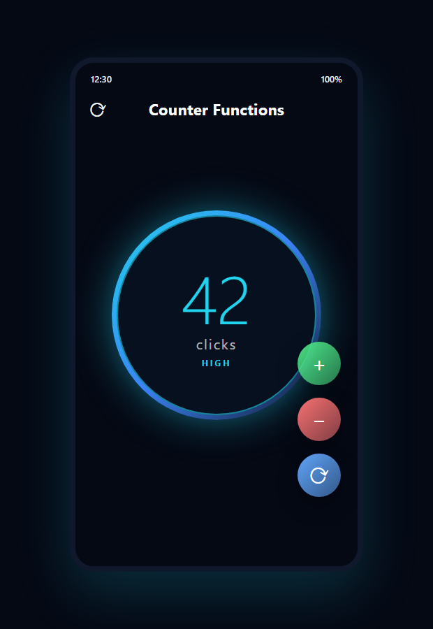

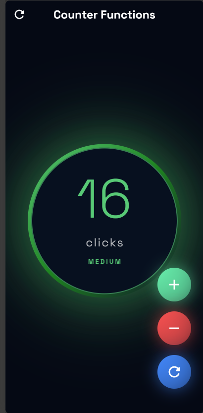

## Índice

1. [Descripción](#descripción)
2. [Estructura del proyecto](#estructura-del-proyecto)
3. [Arquitectura](#arquitectura)
4. [Pantalla principal y estados](#pantalla-principal-y-estados)
5. [Estados del contador](#estados-del-contador)
6. [Capturas de la aplicación](#capturas-de-la-aplicación)
7. [Tecnologías y dependencias](#tecnologías-y-dependencias)
8. [Cómo ejecutar](#cómo-ejecutar)
9. [Pruebas](#pruebas)
10. [Regenerar las imágenes](#regenerar-las-imágenes)
11. [Publicación con GitHub Pages](#publicación-con-github-pages)

---

## Descripción

`brian_mdi_230308` es una app Flutter de ejemplo que implementa un contador con tres controles flotantes (sumar, restar y reiniciar). La interfaz cambia de color, anima el número y muestra un estado textual (`LOW`, `MEDIUM`, `HIGH`, `NEGATIVE`) según el valor del contador.

- Framework: [Flutter](https://flutter.dev) + Material 3
- Tipografía: Space Grotesk vía `google_fonts`

---

## Estructura del proyecto

Los archivos se organizan con el layout estándar de Flutter; los runners de plataforma y las carpetas de herramientas se generan automáticamente.

| Ruta | Propósito |
| --- | --- |
| `lib/` | Código fuente Dart de la aplicación |
| `lib/main.dart` | Punto de entrada, `MyApp` y tema global |
| `lib/Presentacion/Screens/counter_functions.dart` | Pantalla principal `CounterFunctionsScrens` |
| `lib/Presentacion/Screens/counter_screns.dart` | Pantalla simple alternativa `CounterScrens` |
| `test/` | Pruebas de widget (`widget_test.dart`) |
| `tool/capturas/` | Genera las capturas PNG de la app (`generar.ps1`) |
| `tool/diagramas/` | Exporta los diagramas a PNG (`exportar.mjs`) |
| `android/` | Runner Android (Kotlin + Gradle) |
| `ios/` | Runner iOS (Swift + Xcode) |
| `web/` | Runner web (HTML5 + manifest) |
| `windows/` | Runner Windows (C++ + CMake) |
| `linux/` | Runner Linux (C++ + CMake) |
| `macos/` | Runner macOS (Swift + Xcode) |
| `docs/` | Documentación y diagramas (este sitio) |
| `build/` | Artefactos compilados (generado) |
| `.dart_tool/` · `.idea/` · `pubspec.*` | Configuración de paquetes e IDE |

### Diagrama de estructura

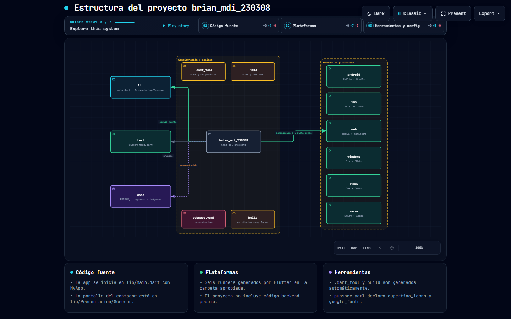

Versión interactiva: [estructura.html](estructura.html)

### Árbol de directorios completo

```text
brian_mdi_230308/
├── lib/
│   ├── main.dart
│   └── Presentacion/
│       └── Screens/
│           ├── counter_functions.dart
│           └── counter_screns.dart
├── test/
│   └── widget_test.dart
├── tool/
│   ├── capturas/
│   │   ├── generar.ps1
│   │   └── generar_capturas_test.dart
│   └── diagramas/
│       └── exportar.mjs
├── android/          # Runner Android
├── ios/              # Runner iOS
├── web/              # Runner web
├── windows/          # Runner Windows
├── linux/            # Runner Linux
├── macos/            # Runner macOS
├── docs/             # Documentación y diagramas
├── build/            # Salidas (generado)
├── .dart_tool/       # Config de paquetes (generado)
├── .idea/            # Config del IDE
├── pubspec.yaml      # Dependencias
├── analysis_options.yaml
├── .metadata
├── .gitignore
└── README.md
```

---

## Arquitectura

La app arranca en `lib/main.dart`, donde `MyApp` configura un `MaterialApp` Material 3 con tema oscuro y selecciona `CounterFunctionsScrens` como pantalla inicial. La pantalla es un widget con estado que posee el valor `clickCounter` y lo modifica a través de `setState`.

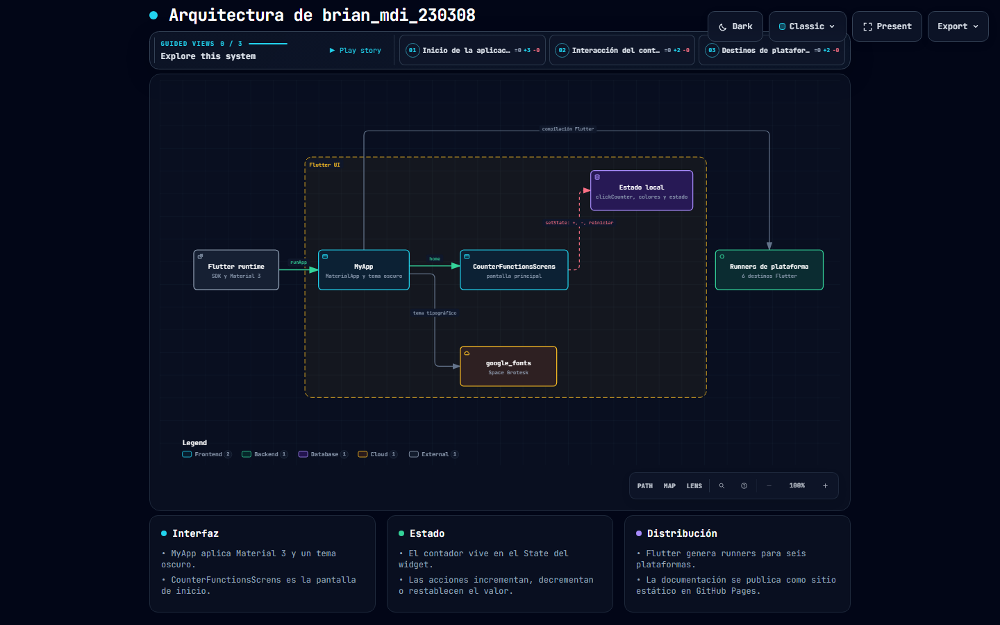

Versión interactiva: [architecture.html](architecture.html)

### Flujo de interacción

El diagrama `interaccion.html` resume qué ocurre al pulsar cada botón:

1. El usuario toca `+`, `−` o `⟳`.
2. El handler correspondiente (`increaseCounter`, `decreaseCounter`, `resetCounter`) invoca `setState`.
3. `clickCounter` se actualiza.
4. Los *getters* `primaryColor`, `secondaryColor` y `counterStatus` derivan colores y estado.
5. El widget se reconstruye y anima el cambio.

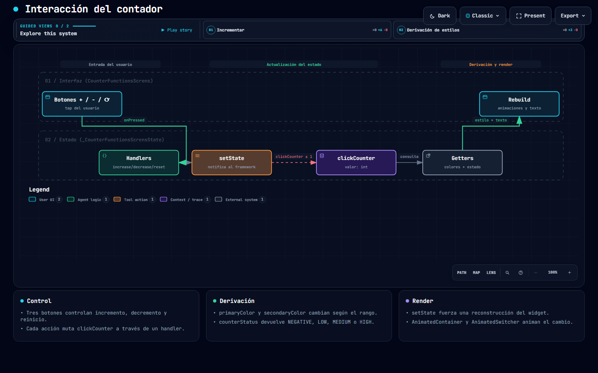

Versión interactiva: [interaccion.html](interaccion.html)

---

## Pantalla principal y estados

`CounterFunctionsScrens` (en `lib/Presentacion/Screens/counter_functions.dart`) dibuja:

- Un **AppBar** transparente con el título "Counter Functions" y un botón de reinicio.
- Un **círculo animado** (`AnimatedContainer`) que cambia de gradiente y sombra.
- El **valor actual** con la tipografía Space Grotesk (tamaño 110).
- El texto `click` / `clicks` y una insignia de estado animada (`AnimatedSwitcher`).
- Tres **botones flotantes circulares**: sumar (verde), restar (rojo) y reiniciar (azul).

| Control | Función | Icono |
| --- | --- | --- |
| Sumar | `increaseCounter()` — `clickCounter++` | `Icons.add` |
| Restar | `decreaseCounter()` — `clickCounter--` | `Icons.remove` |
| Reiniciar | `resetCounter()` — `clickCounter = 0` | `Icons.refresh_rounded` |

---

## Estados del contador

Los colores y el estado se derivan del rango de `clickCounter`:

| Rango | `counterStatus` | `primaryColor` | `secondaryColor` |
| --- | --- | --- | --- |
| `< 0` | `NEGATIVE` | `redAccent` | `red` |
| `0 – 9` | `LOW` | `cyanAccent` | `blueAccent` |
| `10 – 19` | `MEDIUM` | degradado `greenAccent → green` | degradado `green → #006400` |
| `≥ 20` | `HIGH` | `greenAccent` | `#006400` |

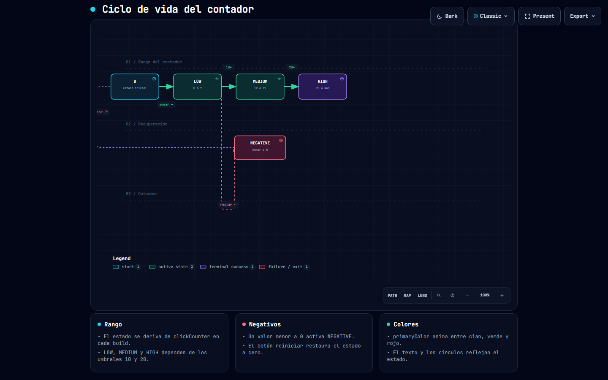

Versión interactiva: [ciclo-vida.html](ciclo-vida.html)

---

## Capturas de la aplicación

Estas imágenes no son maquetas: se generan renderizando la pantalla real
(`CounterFunctionsScrens`) con la tipografía y los colores de la aplicación, una
por estado del contador. Todas son 1080×2340 px.

| Estado | Valor | `counterStatus` | Captura |
| --- | --- | --- | --- |
| LOW | `0` | cian | 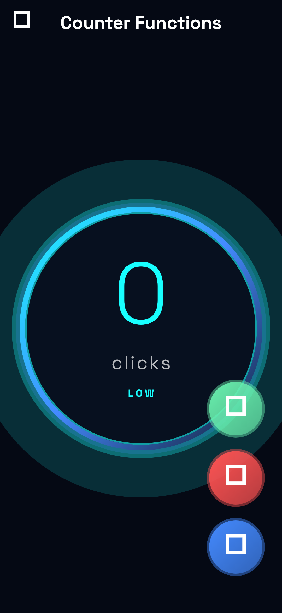 |
| MEDIUM | `14` | verde degradado | 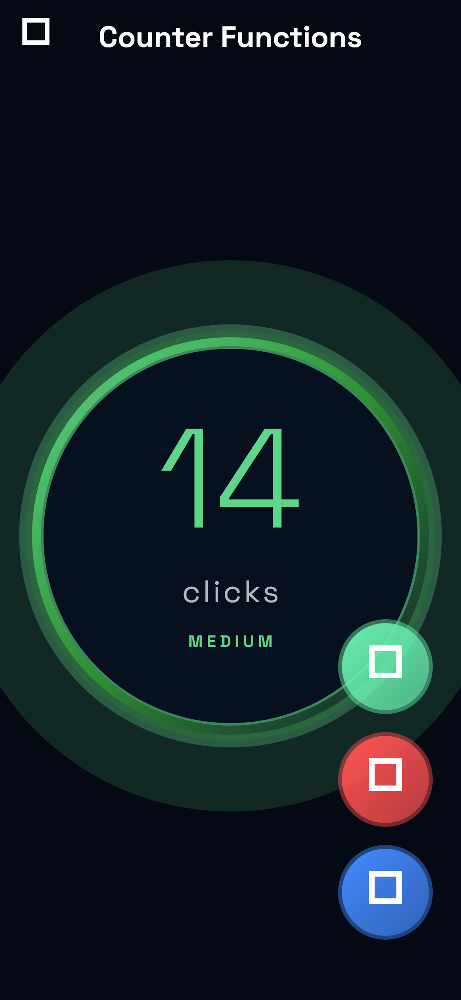 |
| HIGH | `24` | verde | 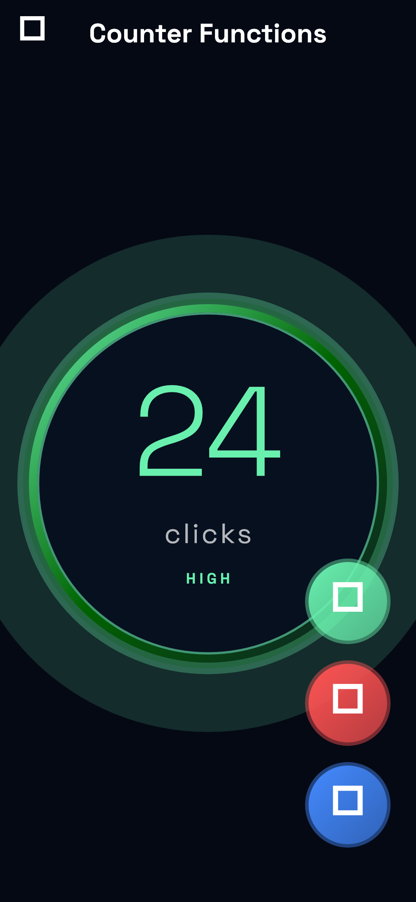 |
| NEGATIVE | `-3` | rojo | 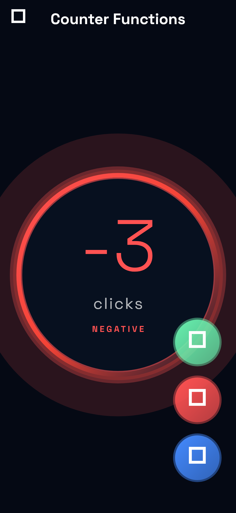 |

El valor `14` se elige a propósito para que `primaryColor` y `secondaryColor` caigan
en el tramo `MEDIUM`, donde `Color.lerp` interpola el degradado según
`(clickCounter - 10) / 10`.

Para regenerarlas, ver [Regenerar las imágenes](#regenerar-las-imágenes).

---

## Tecnologías y dependencias

Definidas en `pubspec.yaml`:

| Paquete | Versión | Uso |
| --- | --- | --- |
| `flutter` | SDK ^3.13.3 | Framework |
| `cupertino_icons` | ^1.0.8 | Iconos Cupertino |
| `google_fonts` | ^8.2.1 | Tipografía Space Grotesk |
| `flutter_test` + `flutter_lints` | ^6.0.0 | Pruebas y lints (dev) |

---

## Cómo ejecutar

```bash
# Instalar dependencias
flutter pub get

# Ejecutar en un dispositivo / emulador
flutter run

# Ejecutar en navegador
flutter run -d chrome
```

## Pruebas

```bash
# Análisis estático (lints)
flutter analyze

# Pruebas de widget
flutter test
```

El test `test/widget_test.dart` comprueba que la pantalla arranca en `0`, que el botón de sumar incrementa a `1` y que la interfaz responde al toque.

---

## Regenerar las imágenes

Las imágenes de `docs/imagenes/` no se editan a mano: se generan desde el código.

| Script | Qué produce |
| --- | --- |
| `tool/capturas/generar.ps1` | Las cuatro capturas de la app en `imagenes/app-estado-*.png` |
| `node tool/diagramas/exportar.mjs` | Los PNG de los diagramas en `imagenes/diagrama-*.png` |

### Capturas de la aplicación

```powershell
powershell -ExecutionPolicy Bypass -File tool/capturas/generar.ps1
```

El script descarga los `.ttf` de Space Grotesk a `tool/capturas/.fuentes/`
(está en `.gitignore`; solo se necesitan para renderizar) y después ejecuta
`tool/capturas/generar_capturas_test.dart` con `--update-goldens`. El arnés
registra las fuentes con los nombres de familia que espera `google_fonts`
(`SpaceGrotesk_regular`, `SpaceGrotesk_300`, `SpaceGrotesk_700`) y desactiva
la descarga en tiempo de ejecución, de modo que la captura es idéntica sin
conexión.

Este archivo **no** forma parte de la suite `flutter test`: hay que invocarlo
explícitamente con su ruta.

### PNG de los diagramas

```bash
node tool/diagramas/exportar.mjs
```

Exporta los cuatro diagramas a 1600×1000 y 1920×1080, en tema claro y oscuro.
Reutiliza el navegador headless del skill **Archify**; si no detecta Chrome,
Chromium ni Edge, define la ruta manualmente:

```bash
# Linux / macOS
ARCHIFY_CHROME=/usr/bin/chromium node tool/diagramas/exportar.mjs

# Windows (PowerShell)
$env:ARCHIFY_CHROME = "C:\Program Files (x86)\Microsoft\Edge\Application\msedge.exe"
node tool\diagramas\exportar.mjs
```

---

## Publicación con GitHub Pages

El sitio se publica desde la rama **`gh-pages`**, cuya raíz es una copia de esta
carpeta `docs/`.

1. Copia la documentación en un worktree de `gh-pages`:

   ```bash
   git worktree add -B gh-pages ../gh-pages origin/gh-pages
   # reemplaza el contenido del sitio, conservando .git
   cp -r docs/. ../gh-pages/
   cd ../gh-pages && git add -A && git commit -m "Publish documentation (GitHub Pages)"
   ```

2. Súbelo: `git push origin gh-pages`.
3. En el repositorio, abre **Settings → Pages** y confirma que el origen sea
   **Deploy from a branch** → **gh-pages** → **/(root)**.

La URL queda en `https://<propietario>.github.io/MDI-Brian-Jesus-230308/`, con
**index.html** como portada.

> **El repositorio debe ser público.** GitHub Pages solo publica repositorios
> privados en planes de pago (Pro, Team o Enterprise). Mientras el repositorio
> sea privado el push se completa pero la URL de Pages devuelve 404.

El marcador `docs/.nojekyll` permite que GitHub Pages sirva los archivos estáticos sin procesamiento Jekyll.

---

## Diagramas disponibles

| Diagrama | Interactivo | Imagen PNG | Claro | Oscuro |
| --- | --- | --- | --- | --- |
| Arquitectura | [architecture.html](architecture.html) | [architecture.png](architecture.png) | [1600×1000](imagenes/diagrama-arquitectura-1600x1000-light.png) · [1920×1080](imagenes/diagrama-arquitectura-1920x1080-light.png) | [1600×1000](imagenes/diagrama-arquitectura-1600x1000-dark.png) · [1920×1080](imagenes/diagrama-arquitectura-1920x1080-dark.png) |
| Estructura del proyecto | [estructura.html](estructura.html) | [estructura.png](imagenes/estructura.png) | [1600×1000](imagenes/diagrama-estructura-1600x1000-light.png) · [1920×1080](imagenes/diagrama-estructura-1920x1080-light.png) | [1600×1000](imagenes/diagrama-estructura-1600x1000-dark.png) · [1920×1080](imagenes/diagrama-estructura-1920x1080-dark.png) |
| Interacción del contador | [interaccion.html](interaccion.html) | [interaccion.png](imagenes/interaccion.png) | [1600×1000](imagenes/diagrama-interaccion-1600x1000-light.png) · [1920×1080](imagenes/diagrama-interaccion-1920x1080-light.png) | [1600×1000](imagenes/diagrama-interaccion-1600x1000-dark.png) · [1920×1080](imagenes/diagrama-interaccion-1920x1080-dark.png) |
| Ciclo de vida de estados | [ciclo-vida.html](ciclo-vida.html) | [ciclo-vida.png](imagenes/ciclo-vida.png) | [1600×1000](imagenes/diagrama-ciclo-vida-1600x1000-light.png) · [1920×1080](imagenes/diagrama-ciclo-vida-1920x1080-light.png) | [1600×1000](imagenes/diagrama-ciclo-vida-1600x1000-dark.png) · [1920×1080](imagenes/diagrama-ciclo-vida-1920x1080-dark.png) |

Los diagramas son HTML autocontenidos (sin backend ni CDN) generados con **Archify**; sus fuentes editables son los `.archify.json` correspondientes.

### Galería

| Estructura | Arquitectura | Interacción | Ciclo de vida |
| --- | --- | --- | --- |
| 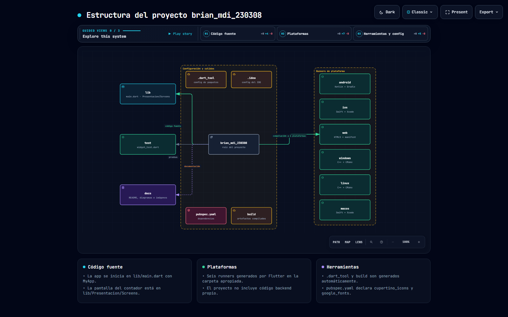 | 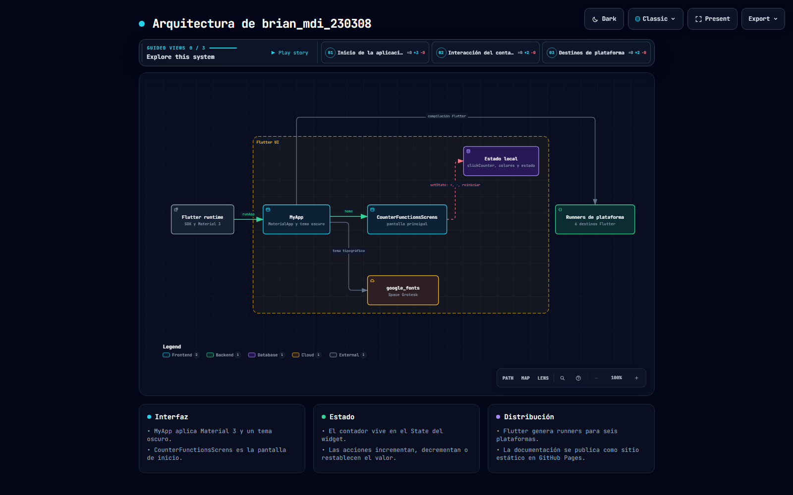 | 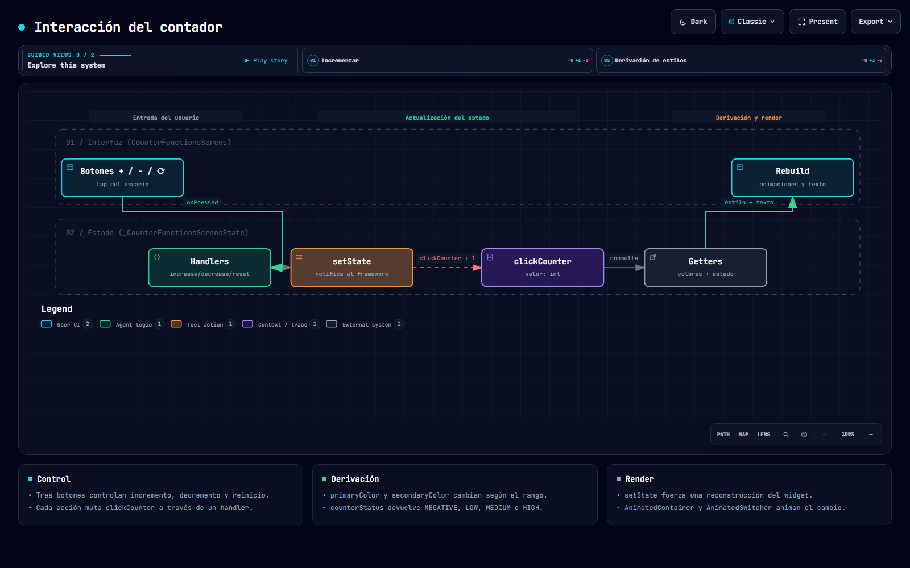 | 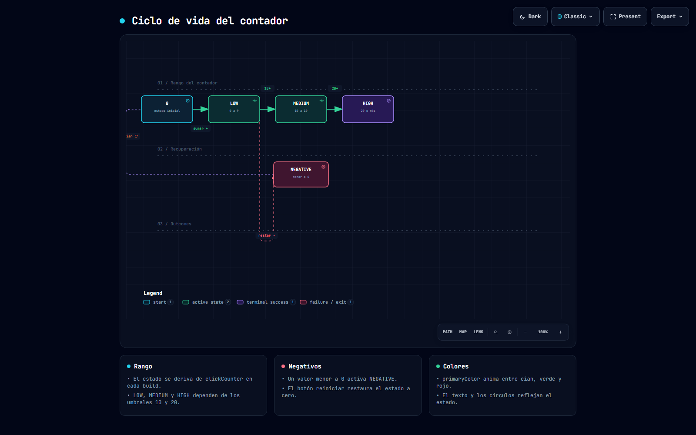 |
| 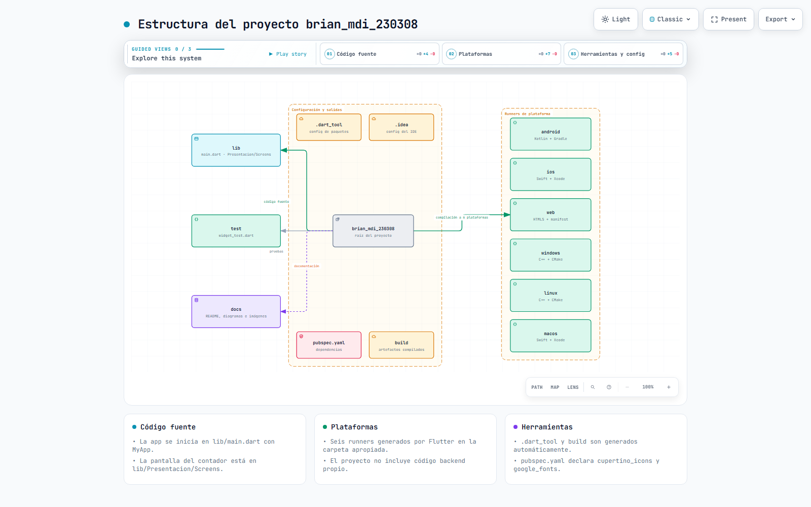 | 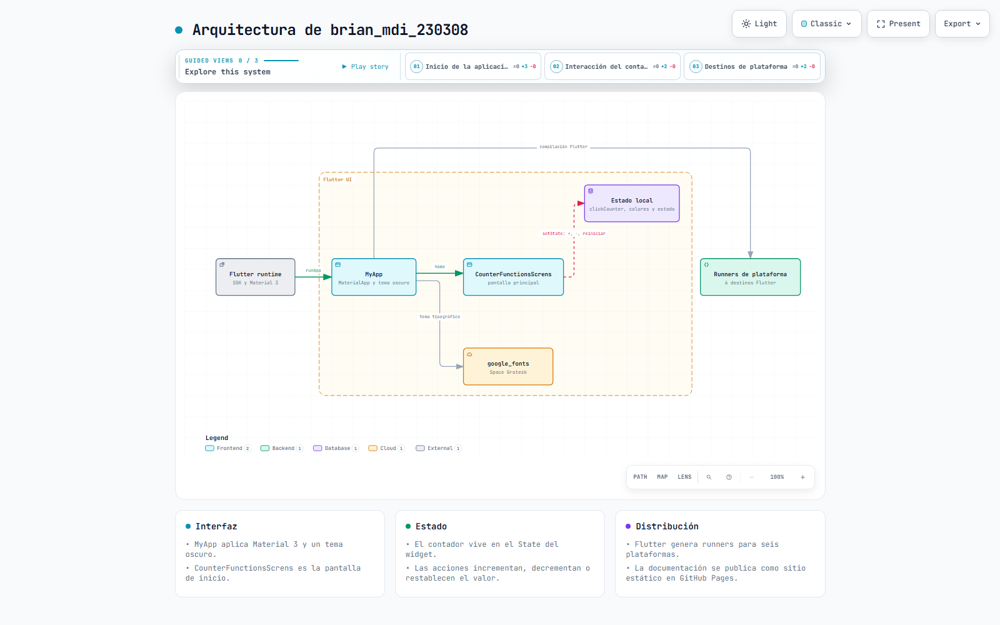 | 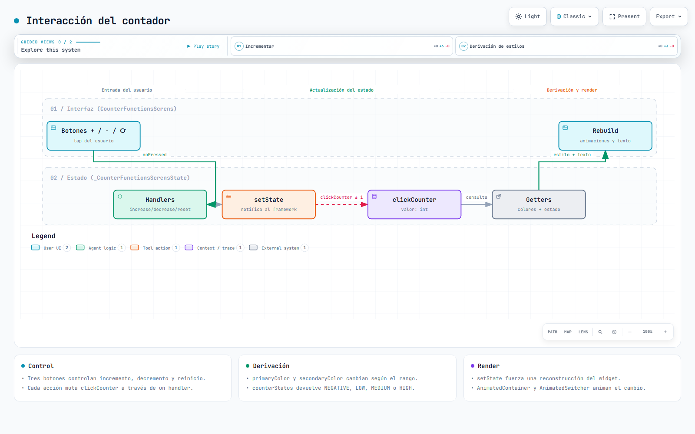 | 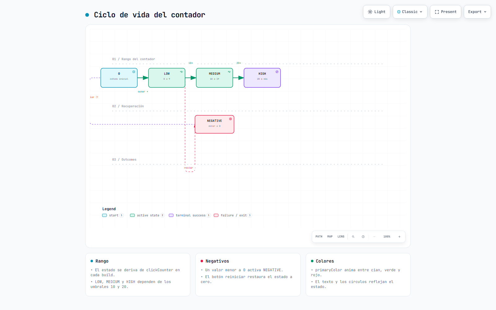 |

---

*Documentación generada el 18 de septiembre de 2026.*
